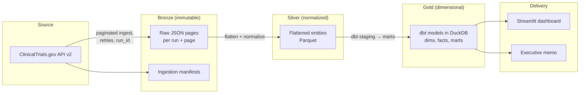
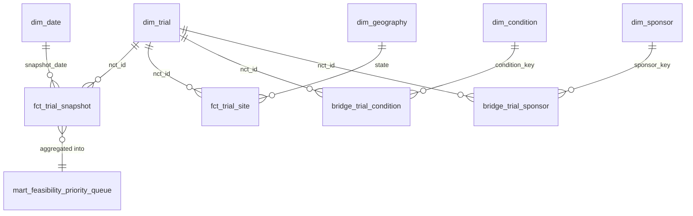

# Clinical Trial Access & Recruitment Competition Intelligence

A tested, local-first healthcare analytics platform that ingests and versions public
ClinicalTrials.gov registry data, tracks trial-status changes across weekly snapshots,
and prioritizes condition–geography–phase markets for **feasibility review** using
transparent, documented operational signals.

> 📑 **Executive Business Case & Stakeholder Brief:** See [`docs/business_case.md`](docs/business_case.md) for full clinical operational ROI analysis and the site-feasibility decision framework.

> **Interpretation rule:** every output of this project is a *public-registry-based
> planning signal*, not a recruitment forecast, not clinical decision support, and not
> a judgment of any site, sponsor, or population.

---

## 1. Executive summary

Sponsors and CROs must decide where to conduct clinical trials. Before activating a
site, feasibility teams need to know whether a therapeutic area and geography shows
high competing-study activity, concentrated sponsor activity, repeated site
participation, or potential patient-access barriers. This project builds a
reproducible pipeline (Python → DuckDB → dbt → Streamlit) over ClinicalTrials.gov API
v2 that produces a ranked **Feasibility Review Priority Queue** for Alzheimer's
disease and related dementias in the United States. All findings are computed only
after the pipeline runs on real source data — nothing is invented.

## 2. The clinical-operations decision supported

**Stakeholder:** Director of Clinical Operations / Head of Site Feasibility.

**Question:** *"Which condition–geography–phase combinations should receive a
feasibility review before we invest in activating or expanding clinical trial sites?"*

**Decision:** Prioritize feasibility reviews where recruiting-trial density, recent
trial growth, sponsor concentration, and listed-site overlap suggest potential
operational or recruitment competition — then validate with feasibility outreach
before committing startup resources.

## 3. Why this is not a recruitment prediction model

- No participant-level data exists in this project.
- Registry listing ≠ verified recruitment activity; statuses can lag operations.
- Trial density is a *potential competition signal*, not proof of competition.
- The priority score is a transparent weighted ranking of public-record signals with
  every component and denominator displayed — it is not a validated predictive
  probability.
- See [`docs/clinical_interpretation_guardrails.md`](docs/clinical_interpretation_guardrails.md).

## 4. Public data source and API documentation

| Item | Value |
|---|---|
| Source | [ClinicalTrials.gov](https://clinicaltrials.gov) public registry (NLM) |
| API | [API v2 documentation](https://clinicaltrials.gov/data-api/api) |
| Endpoint | `GET https://clinicaltrials.gov/api/v2/studies` |
| OpenAPI spec | `https://clinicaltrials.gov/api/oas/v2` |
| Pagination | `pageSize` + `pageToken`; follow `nextPageToken` until absent |
| History | The API returns only *current* records; this project constructs history by retaining repeated snapshots |

All query parameters are configured in [`config/project_config.yml`](config/project_config.yml)
and were verified against the live API (parameter names: `query.cond`,
`filter.overallStatus`, `filter.advanced`, `pageSize`, `pageToken`, `countTotal`).

## 5. Architecture diagram



Full detail: [`docs/architecture.md`](docs/architecture.md).

## 6. Data model diagram



## 7. Project scope

- **Therapeutic area:** Alzheimer's disease and related dementias (config-driven taxonomy).
- **Geography:** United States (all raw records preserved; U.S.-only in marts).
- **Study type:** Interventional.
- **Statuses:** RECRUITING, ACTIVE_NOT_RECRUITING, NOT_YET_RECRUITING, COMPLETED.
- **Phases:** EARLY_PHASE1 – PHASE4 where available.
- **Cadence:** Weekly snapshots; history accrues from this project's own runs.

## 8. Setup instructions

Prerequisites: Python 3.11+, [uv](https://docs.astral.sh/uv/), `make`.

```bash
git clone <your-repo-url> clinical-trial-intelligence
cd clinical-trial-intelligence
make setup
```

## 9. Installation (uv)

`make setup` runs `uv sync --all-groups`, copies `.env.example` → `.env`, and creates
the git-ignored `data/` directories. Dependencies are declared in
[`pyproject.toml`](pyproject.toml).

## 10. Environment configuration

Copy [`.env.example`](.env.example) to `.env`. No API keys are needed — the API is
public. Variables control local paths, logging, and optional HTTP overrides.

## 11. How to run a first ingestion

```bash
make ingest                      # python -m src.cli ingest --condition "Alzheimer Disease"
```

## 12. How to run repeat snapshots

Run `make ingest` weekly (cron, systemd timer, or GitHub Actions). Each run gets a
unique `ingestion_run_id`; completed runs are never silently re-downloaded
(incremental default), and `make full-refresh` forces a complete re-pull.

## 13. How to run dbt models and tests

```bash
make dbt-run
make dbt-test
```

## 14. How to build the data-quality report

```bash
make quality-report
```

## 15. How to start the Streamlit dashboard

```bash
make dashboard
```

## 16. Data model and grains

| Layer | Object | Grain |
|---|---|---|
| Silver | `silver_trials` | NCT ID × ingestion run |
| Silver | `silver_trial_locations` | NCT ID × facility × city × state × run |
| Gold | `dim_trial` | NCT ID |
| Gold | `fct_trial_snapshot` | NCT ID × snapshot date |
| Gold | `fct_trial_site` | NCT ID × facility × city × state × snapshot date |
| Gold | `mart_feasibility_priority_queue` | condition group × state × phase × latest snapshot |

## 17. Metric definitions

Fully documented in [`docs/metric_definitions.md`](docs/metric_definitions.md). Core
rules: trial counts are always `COUNT(DISTINCT nct_id)`; site counts use the documented
facility grain and are never presented as investigator capacity; only complete
(`success`) snapshots feed metrics.

## 18. Feasibility score methodology

Weighted min-max-normalized components (weights in `config/score_weights.yml` and a
dbt seed): recruiting-trial count (0.35), recent recruiting growth (0.20), sponsor
concentration (0.20), site overlap (0.15), data-confidence adjustment (0.10). All
components, denominators, and deterministic explanations are displayed.

## 19. Data-quality and clinical interpretation guardrails

Automated checks cover ingestion integrity, trial validation, relationship integrity,
geographic validity, and metric rules — 73 dbt data tests plus a 47-test pytest suite,
cross-layer reconciliation, and schema-drift detection
([`docs/data_quality_framework.md`](docs/data_quality_framework.md)). Interpretation
guardrails prohibit claims about recruitment failure, patient eligibility, healthcare
quality, or sponsor performance
([`docs/clinical_interpretation_guardrails.md`](docs/clinical_interpretation_guardrails.md)).

## 20. Limitations

- Registry records can be incomplete, delayed, or inconsistently updated.
- Status history begins when this project's snapshots begin.
- Facility names are not stable unique identifiers; normalization is best-effort.
- Density proxies are not population-adjusted until an ACS layer is added.
- Portfolio demonstration only; real decisions require qualified clinical-operations review.

## 21. Scenario-value methodology

No fake ROI. A configurable scenario calculator (`config/roi_assumptions.yml`) lets an
organization test whether a feasibility-review process could justify its cost using
*its own* site-startup and study-burn assumptions, under low/base/high scenarios.

## 22. Documentation index

| Document | Contents |
|---|---|
| [`PROJECT_DOCUMENTATION.md`](PROJECT_DOCUMENTATION.md) | complete project documentation with architecture, data-model, and flow diagrams |
| [`docs/study_guide.md`](docs/study_guide.md) | guided learning path: run it, trace a record, read the code, exercises |
| [`docs/architecture.md`](docs/architecture.md) | pipeline and layer design |
| [`docs/data_dictionary.md`](docs/data_dictionary.md) | every layer, entity, and column |
| [`docs/source_documentation.md`](docs/source_documentation.md) | API v2 usage, verification, history caveat |
| [`docs/metric_definitions.md`](docs/metric_definitions.md) | formula + grain for every metric and the score |
| [`docs/clinical_interpretation_guardrails.md`](docs/clinical_interpretation_guardrails.md) | required/prohibited language, enforcement |
| [`docs/assumptions_and_limitations.md`](docs/assumptions_and_limitations.md) | numbered assumptions register |
| [`docs/data_quality_framework.md`](docs/data_quality_framework.md) | five check layers, tests, severity philosophy |
| [`docs/dashboard_spec.md`](docs/dashboard_spec.md) | page-by-page dashboard specification |
| [`docs/executive_memo_template.md`](docs/executive_memo_template.md) | stakeholder memo template with live example figures |
| [`docs/development_log.md`](docs/development_log.md) | complete step-by-step build record (Phases 1–7) |

## 23. Roadmap

1. MVP: ClinicalTrials.gov-only pipeline, marts, dashboard (Phases 1–7).
2. ACS population layer for population-adjusted density.
3. CDC/ATSDR SVI county-level access-barrier context.
4. Optional oncology module via NCI CTS API.
5. Warehouse portability (BigQuery/Snowflake) and orchestration (Dagster/Airflow).

## 24. Resume bullet points *(measured on the 2026-07-24 build)*

- Built a Python, DuckDB, dbt, and Streamlit clinical-operations intelligence platform
  that ingests and versions 2,592 public ClinicalTrials.gov trial records into
  29 tested analytics models with full bronze→silver→gold reconciliation.
- Designed snapshot-based status-history models and a 5-layer automated data-quality
  framework (73 dbt tests, 47 pytest tests, quarantine, schema-drift detection)
  tracking 419 recruiting Alzheimer's studies across 50 U.S. states and 6,241 listed
  facilities.
- Developed an interpretable feasibility-review prioritization framework scoring 449
  condition–geography–phase segments with deterministic explanations, explicitly
  distinguishing public-record signals from enrollment predictions.

## 25. Interview talking points

1. **Why immutable bronze?** The registry API serves current records only —
   re-downloading cannot recover history, so raw snapshots are the historical asset.
2. **Reproducibility:** every run has a manifest (query hash, counts, status);
   partial runs can never contaminate metrics; silver reconciles to manifests and
   the warehouse reconciles to silver.
3. **Why history metrics start at zero:** honest snapshot-transition design with a
   labeled registry-date proxy until history accrues — and a flag column exposing
   which source fed the score.
4. **Identity design:** NCT IDs are stable keys; facility names are not — so site
   overlap is presented as a best-effort listing signal, never capacity.
5. **Grain protection:** one shared intermediate model feeds all segment marts, and
   dbt uniqueness/relationship tests pin every declared grain.
6. **Density ≠ competition:** the score ranks segments for *human review*; language
   guardrails are enforced mechanically (banner function, embedded interpretation
   notes, empty contacts model).
7. **Scenario models vs fake ROI:** value framing is arithmetic over editable
   assumptions with an embedded disclaimer — nothing is presented as observed.
8. **Scaling path:** config-driven queries, dbt portability to cloud warehouses,
   orchestration via Dagster/Airflow, ACS/SVI enrichment on the roadmap.

---

**Disclaimer:** Source: ClinicalTrials.gov public registry data. This project is an
analytical portfolio demonstration. Metrics are feasibility-review signals, not
enrollment forecasts. Validate with qualified clinical-operations teams before any
real-world use.
