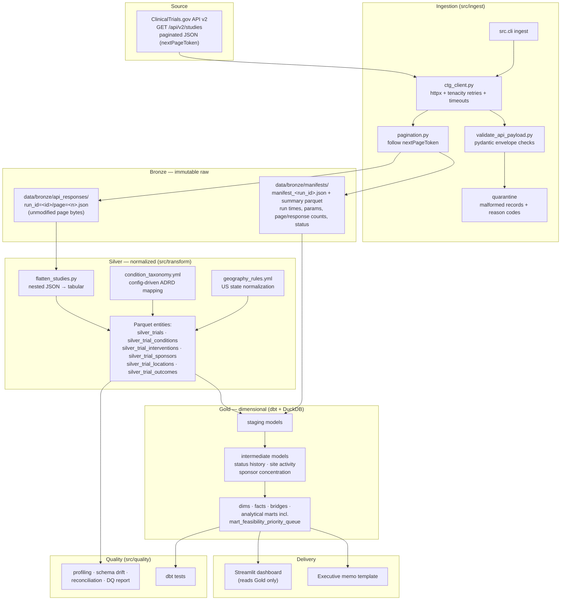

# Architecture

Clinical Trial Access & Recruitment Competition Intelligence is a local-first,
medallion-architecture analytics platform. Every layer is reproducible from the layer
below it, and the bronze layer is immutable so any downstream logic change can be
replayed against the exact bytes originally received from the source.

## 1. System overview



## 2. Layer contracts

### Bronze — immutable raw
- One JSON file per API page per ingestion run: `run_id=<run_id>/page=<page>.json`,
  saved byte-for-byte before any parsing beyond envelope validation.
- One manifest per run: run ID (UTC timestamp + UUID), start/end time, endpoint,
  full query parameters, page count, response count, success/failure state.
- Never edited, never deleted by pipeline code. Re-runs create new run IDs;
  completed runs are not re-downloaded in incremental mode.
- Malformed records go to a quarantine report with reason codes — never dropped
  silently.

### Silver — clean normalized entities
- Flattened, typed, standardized Parquet per entity, grain = source entity ×
  ingestion run (see `docs/data_dictionary.md`, Phase 4+).
- Config-driven condition taxonomy and geography rules (version-controlled YAML;
  no runtime LLM classification).
- Data-quality flags (`record_quality_flag`, `usable_geography_flag`,
  `dementia_relevance_flag`) computed here, not in dashboards.
- All records preserved, including non-U.S. locations excluded from MVP marts.

### Gold — business-ready dimensional model
- Built exclusively by dbt (dbt-duckdb) inside `data/warehouse/clinical_trials.duckdb`.
- Staging → intermediate → marts; each layer documents and tests its grain.
- Snapshot facts turn repeated ingestion runs into longitudinal status history —
  the source API only serves current records.
- The dashboard reads Gold marts only; no dashboard-side business logic.

## 3. Snapshot-history design

```mermaid
sequenceDiagram
    participant W as Weekly run
    participant B as Bronze
    participant G as fct_trial_snapshot
    W->>B: run_id=2026-07-24T…-uuid (pages 1..N)
    B->>G: one row per NCT ID per snapshot date
    Note over G: status_changed_from_previous_snapshot_flag<br/>compares consecutive snapshots
    W->>B: run_id=2026-07-31T…-uuid
    B->>G: new snapshot rows; current_record_flag moves
```

Key consequence: history depth equals the age of this project's own snapshot
collection. This is documented, not hidden.

## 4. Technology choices

| Concern | Choice | Rationale |
|---|---|---|
| Dependency mgmt | uv | Fast, lockfile-based, reproducible |
| HTTP | httpx + tenacity | Timeouts, typed exceptions, exponential backoff |
| Validation | pydantic v2 | Envelope/schema validation with clear errors |
| Storage | Parquet + DuckDB | Local-first, columnar, zero-ops warehouse |
| Modeling | dbt-duckdb | Tested, documented, grain-safe SQL layers |
| Dashboard | Streamlit + Plotly | Fast decision-ready delivery from Gold marts |
| CI | GitHub Actions | Lint, unit tests, dbt build on synthetic fixtures |

## 5. Reproducibility and operations

- `Makefile` is the single entry point (`make pipeline` = ingest → transform →
  dbt-run → dbt-test → quality-report).
- All query parameters, taxonomy, geography rules, score weights, and scenario
  assumptions live in `config/*.yml` under version control.
- `.env` carries only local paths/log levels — no secrets exist in this project.
- Logging via loguru with run-context fields; no sensitive data is ever logged
  (the source is public, but site contacts/investigators are still excluded from
  all delivery surfaces).

## 6. Scaling path (roadmap, not MVP)

- Swap dbt-duckdb profile for BigQuery/Snowflake; models are ANSI-leaning by design.
- Wrap CLI stages as Dagster/Airflow tasks keyed by `ingestion_run_id`.
- Add ACS population and CDC/ATSDR SVI layers only after the ClinicalTrials.gov-only
  MVP is complete, tested, and documented.
